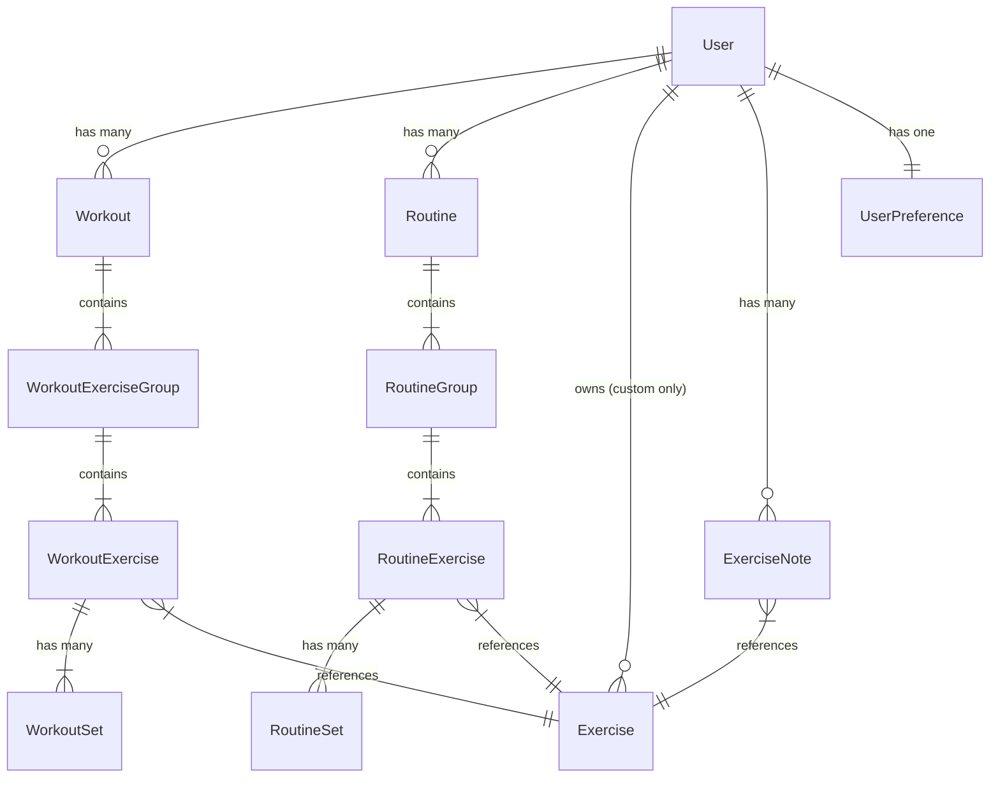

# Data Model Design

## 1. Core Entities

### User

- **Source:** Managed by Better Auth. Auth tables (`users`, `sessions`, `accounts`, `verifications`) follow Better Auth's [core schema](https://www.better-auth.com/docs/concepts/database#core-schema) and should not be modified directly.
- **Role:** Owner of Custom Exercises, Routines, Workouts, and History.

### Exercise

The single source of truth for all movement definitions (Global or Custom).

- **Indexing Strategy:**
  - **Global Exercises:** The full ExerciseDB dataset is indexed into the local database upfront, with periodic syncs to pick up additions. Distinguished by a non-null `external_id`.
  - **Custom Exercises:** Created by the user and stored directly. Distinguished by a non-null `user_id`.
- **Type Inference:** The `type` field is inferred during ExerciseDB indexing based on the `equipment` value:
  - `"body weight"` → `bodyweight_reps`
  - `"assisted"` → `assisted_bodyweight`
  - `"weighted"` → `weighted_bodyweight`
  - Cardio equipment (`"stationary bike"`, `"elliptical machine"`, `"stepmill machine"`, `"skierg machine"`) → `duration`
  - All other equipment → `weight_reps`
  - Custom exercises: user selects type at creation.
- **Attributes:**
  - `id` (UUID - Primary Key)
  - `external_id` (String, Nullable) — _The ID from ExerciseDB (e.g., "0001"). NULL for Custom._
  - `user_id` (FK -> User, Nullable) — _NULL for Global (shared), UUID for Custom (private)._
  - `name` (String)
  - `type` (Enum: `weight_reps`, `bodyweight_reps`, `weighted_bodyweight`, `assisted_bodyweight`, `duration`, `distance_time`)
  - `target_muscles` (JSON String Array)
  - `body_parts` (JSON String Array)
  - `secondary_muscles` (JSON String Array)
  - `equipments` (JSON String Array)
  - `image_url` (String, Nullable) — _GIF URL from ExerciseDB. NULL for Custom unless user provides one._
  - `instructions` (JSON String Array, Nullable) — _Step-by-step instructions from ExerciseDB._
  - `created_at`, `updated_at` (Timestamps)
- **Indexes:**
  - `external_id` (unique, for sync deduplication)
  - `user_id` (for custom exercise queries)
  - `name` (for search)

---

## 2. Workout Structure (The "Container" Model)

To support flexible grouping (supersets) and reordering, we use a 4-tier hierarchy: **Workout -> Group -> Exercise -> Set**.

### Workout (The Session)

Represents a specific instance of training.

- **Attributes:**
  - `id` (UUID)
  - `user_id` (FK -> User)
  - `name` (String) — _e.g., "Monday Chest Day"_
  - `start_time` (Timestamp)
  - `end_time` (Timestamp, Nullable)
  - `status` (Enum: `active`, `completed`, `incomplete`, `discarded`)
  - `note` (String, Nullable) — _Global session note (Tier 3: Session Log)._
- **Indexes:**
  - `user_id` + `start_time` (for history feed, most recent first)
  - `user_id` + `status` (for active/incomplete session lookup)

### WorkoutExerciseGroup (The Container)

A logical grouping of exercises. Corresponds to a "Card" in the UI.

- **Attributes:**
  - `id` (UUID)
  - `workout_id` (FK -> Workout)
  - `order_index` (Integer) — _Position of this card in the workout list._
  - `type` (Computed, not stored) — _Derived at read time: 1 child = Standard; >1 child = Superset._

### WorkoutExercise (The Movement Instance)

An exercise being performed within a group.

- **Attributes:**
  - `id` (UUID)
  - `group_id` (FK -> WorkoutExerciseGroup)
  - `exercise_id` (FK -> Exercise)
  - `order_index` (Integer) — _Order within the superset (A1, A2)._
  - `note` (String, Nullable) — _Instance-specific note (Tier 3: Session Log)._

### WorkoutSet (The Data)

A single unit of effort.

- **Attributes:**
  - `id` (UUID)
  - `workout_exercise_id` (FK -> WorkoutExercise)
  - `order_index` (Integer) — _Set number (1, 2, 3)._
  - `weight` (Decimal, Nullable)
  - `reps` (Integer, Nullable)
  - `distance` (Decimal, Nullable)
  - `duration` (Integer seconds, Nullable)
  - `feedback` (Enum: `too_easy`, `solid`, `struggle`, `failure`, Nullable) — _Qualitative user feedback to drive progression. See [open question](#open-questions)._
  - `completed` (Boolean) — _Has the user checked this off?_

---

## 3. Routine Structure (The Blueprint)

Mirrors the Workout structure exactly, but serves as a template.

### Routine

- `id`, `user_id`, `name`
- `note` (String, Nullable) — _General instructions for the routine (Tier 1: Template Note)._
- `created_at`, `updated_at` (Timestamps)

### RoutineGroup

- `id`, `routine_id`, `order_index`

### RoutineExercise

- `id`, `group_id`, `exercise_id`, `order_index`

### RoutineSet (Target)

- `id`, `routine_exercise_id`, `order_index`
- `target_reps`, `target_weight`, `target_duration`, `target_distance` — _All nullable. NULL for ad-hoc or fresh routines; the engine will suggest values._

---

## 4. Notes (Three-Tier Hierarchy)

The brief defines three tiers of notes. Here is how they map to the data model:

| Tier | Purpose | Location in Schema |
| :-- | :-- | :-- |
| **1. Template Notes** | General instructions for a routine. | `Routine.note` |
| **2. Persistent Exercise Notes** | "Sticky" notes that follow an exercise across all workouts (e.g., machine settings). | `ExerciseNote` (dedicated table) |
| **3. Session Logs** | Ephemeral, instance-specific notes for "right now." | `Workout.note` (global), `WorkoutExercise.note` (per-exercise) |

### ExerciseNote (Persistent / Tier 2)

- **Attributes:**
  - `id` (UUID)
  - `user_id` (FK -> User)
  - `exercise_id` (FK -> Exercise)
  - `content` (String)
  - `created_at`, `updated_at` (Timestamps)
- **Indexes:**
  - `user_id` + `exercise_id` (unique — one note per user per exercise)

---

## 5. User Preferences & Flags

### UserPreference

Per-account settings that follow the user across devices/sessions.

- **Attributes:**
  - `id` (UUID)
  - `user_id` (FK -> User, Unique)
  - `unit` (Enum: `kg`, `lbs`, Default: `kg`)
  - `onboarding_completed` (Boolean, Default: `false`) — _Set to true after first workout intro overlay is dismissed._
- **Notes:** Created on sign-up with defaults. Theme preference is device-specific and stored in localStorage, not here.

---

## 6. ERD Relationships

