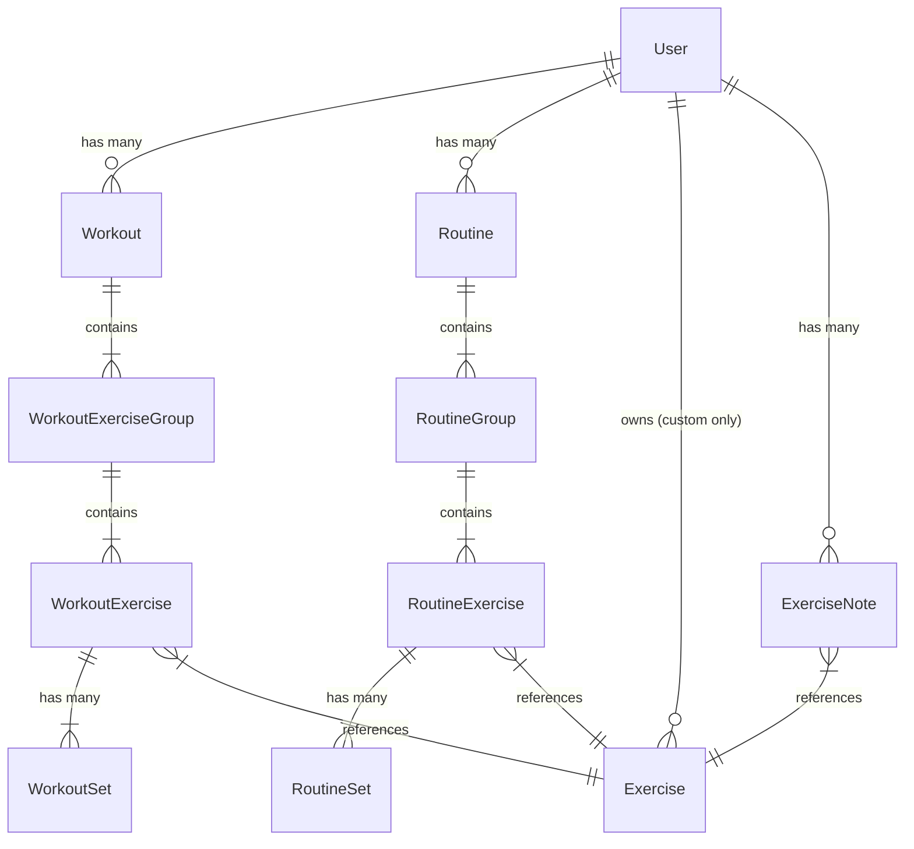

# Data Model Design

## 1. Core Entities

### User

- **Source:** Managed by Better Auth.
- **Role:** Owner of Custom Exercises, Routines, Workouts, and History.

### Exercise

The single source of truth for all movement definitions (Global or Custom).

- **Shadowing Mechanism:**
  - **Global Movements:** Fetched from `exercisedb.dev` on-demand and shadowed (cached) into our local DB the first time a user adds them to a routine or workout.
  - **Custom Movements:** Created by the user and stored directly in our local DB.
- **Attributes:**
  - `id` (UUID - Primary Key)
  - `external_id` (String, Nullable) - _The ID from ExerciseDB (e.g., "0001"). NULL for Custom._
  - `user_id` (FK -> User, Nullable) - _NULL for Global (shared), UUID for Custom (private)._
  - `name` (String)
  - `type` (Enum: `weight_reps`, `bodyweight_reps`, `weighted_bodyweight`, `assisted_bodyweight`, `duration`, `distance_time`)
  - `target_muscles` (String Array)
  - `body_parts` (String Array)
  - `secondary_muscles` (String Array)
  - `equipments` (String Array)

---

## 2. Workout Structure (The "Container" Model)

To support flexible grouping (supersets) and reordering, we use a 4-tier hierarchy: **Workout -> Group -> Exercise -> Set**.

### Workout (The Session)

Represents a specific instance of training.

- **Attributes:**
  - `id` (UUID)
  - `user_id` (FK -> User)
  - `name` (String) - _e.g., "Monday Chest Day"_
  - `start_time` (Timestamp)
  - `end_time` (Timestamp, Nullable)
  - `status` (Enum: `active`, `completed`, `discarded`)
  - `note` (String) - _Global session note._

### WorkoutExerciseGroup (The Container)

A logical grouping of exercises. Corresponds to a "Card" in the UI.

- **Attributes:**
  - `id` (UUID)
  - `workout_id` (FK -> Workout)
  - `order_index` (Integer) - _Position of this card in the workout list._
  - `type` (Inferred) - _If 1 child = Standard; If >1 child = Superset._

### WorkoutExercise (The Movement Instance)

An exercise being performed within a group.

- **Attributes:**
  - `id` (UUID)
  - `group_id` (FK -> WorkoutExerciseGroup)
  - `exercise_id` (FK -> Exercise)
  - `order_index` (Integer) - _Order within the superset (A1, A2)._
  - `note` (String) - _Instance-specific note._

### WorkoutSet (The Data)

A single unit of effort.

- **Attributes:**
  - `id` (UUID)
  - `workout_exercise_id` (FK -> WorkoutExercise)
  - `order_index` (Integer) - _Set number (1, 2, 3)._
  - `weight` (Decimal, Nullable)
  - `reps` (Integer, Nullable)
  - `distance` (Decimal, Nullable)
  - `duration` (Integer seconds, Nullable)
  - `feedback` (Enum: `too_easy`, `solid`, `struggle`, `failure`) - _Qualitative user feedback to drive progression._
  - `completed` (Boolean) - _Has the user checked this off?_

---

## 3. Routine Structure (The Blueprint)

Mirrors the Workout structure exactly, but serves as a template.

### Routine

- `id`, `user_id`, `name`, `note`

### RoutineGroup

- `id`, `routine_id`, `order_index`

### RoutineExercise

- `id`, `group_id`, `exercise_id`, `order_index`

### RoutineSet (Target)

- `id`, `routine_exercise_id`, `order_index`
- `target_reps`, `target_weight`, `target_duration` (etc.) - _Can be NULL for ad-hoc or fresh routines; the engine will suggest values._

---

## 4. Notes & History

### Persistent Exercise Note

"Sticky" notes that appear whenever a user performs a specific exercise.

- **Attributes:**
  - `id` (UUID)
  - `user_id` (FK -> User)
  - `exercise_id` (FK -> Exercise)
  - `content` (String)

---

## 5. ERD Relationships

